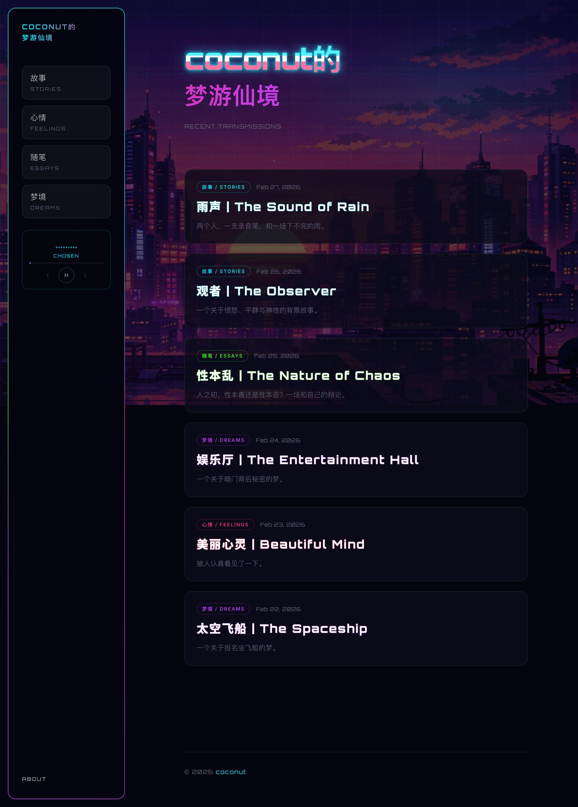
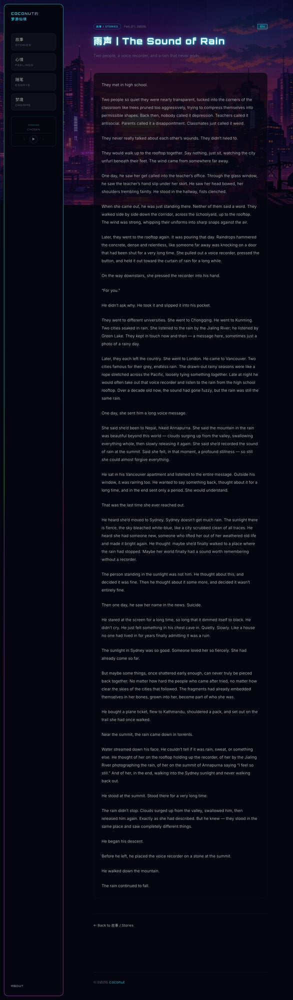

# 🌌 coconut的梦游仙境

> A cyberpunk-themed personal blog — stories, dreams, feelings, and essays in Chinese and English.

**[🔗 Live Site](https://asmellycat.github.io/dreamscape)**



## Features

- **Cyberpunk aesthetic** — neon glows, animated grid background, glitch effects, scanlines, and floating particles
- **Bilingual (中/EN)** — every article available in Chinese and English with a one-click toggle
- **Built-in music player** — persistent playback across pages via SPA navigation
- **SPA transitions** — smooth page transitions without full reloads, with cyberpunk-style loading effects
- **Splash screen** — boot-sequence intro animation on first visit
- **Fully responsive** — sidebar navigation on desktop, compact top bar on mobile

## Article Page

Each post features a bilingual title and a **中 / EN** toggle to switch between Chinese and English content.



## Categories

| Category | Description |
|----------|-------------|
| **故事 / Stories** | Fiction and narrative pieces |
| **心情 / Feelings** | Personal reflections |
| **随笔 / Essays** | Philosophical essays and debates |
| **梦境 / Dreams** | Dream journals |

## Tech Stack

- [Astro](https://astro.build) — static site generator
- [Tailwind CSS](https://tailwindcss.com) — styling
- GitHub Pages — hosting

## Development

```bash
npm install
npm run dev       # local dev server
npm run build     # production build
```

## License

Personal project. All written content © coconut.
